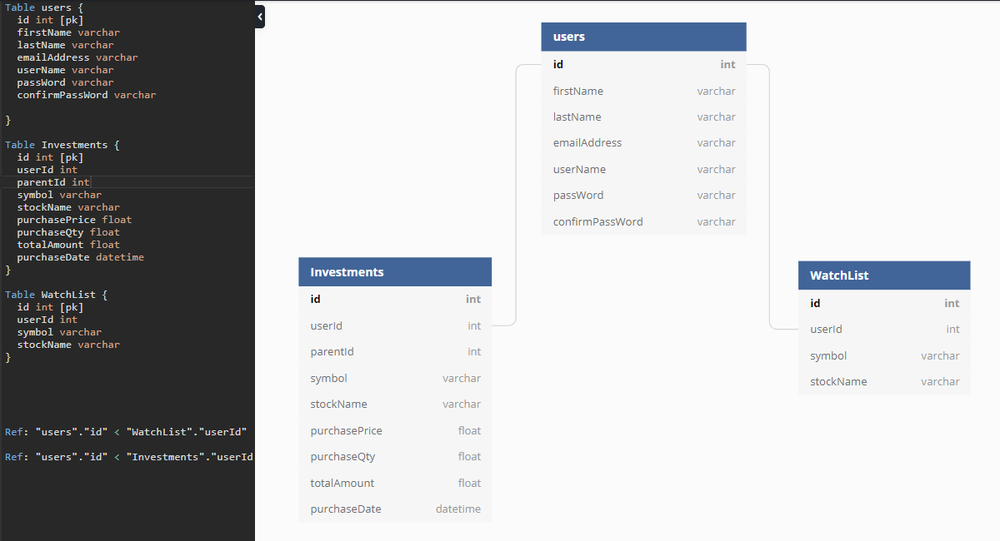

# Capstone Proposal 
## Contact Info 
* Email Address: shirish.stha@gmail.com
* Slack Handle: Shirish Shrestha
* Github (Repo or Your Account): https://github.com/sls-coderepo

## Name of Project: Smart Invest

Smart Invest is a stock investment simulator for beginner investors to learn stock selection based on their prediction of the stock market.

Smart Invest Application is going to be written in React, using ReactStrap, BootStrap, Canvas

## Stock API Provider:  https://www.alphavantage.co

## Initial ERD

## MVP Definition
* User can create account
* User can search for symbol and view the details of company
* User selects the symbol to invest and enters the select amount
* User can add symbol to a watch list 
* User can add alternate route on the invested stock 

## User Stories 
* As a user, in order to invest in stock, I want to register an account
* As a stock investor, in order to invest in stock, I want to search the company  and history of their stock price.
* As a stock investor, in order to invest in stock, I want to purchase the stock 
* As a stock investor, in order to keep track, I want to add selected stocks into watch list.
* As a stock investor, in order to check my prediction, I want to add alternate route to the invested stocks

